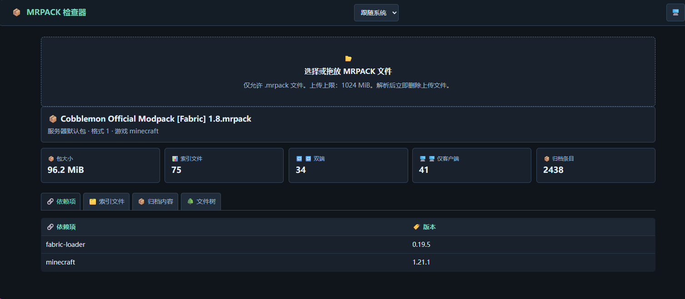
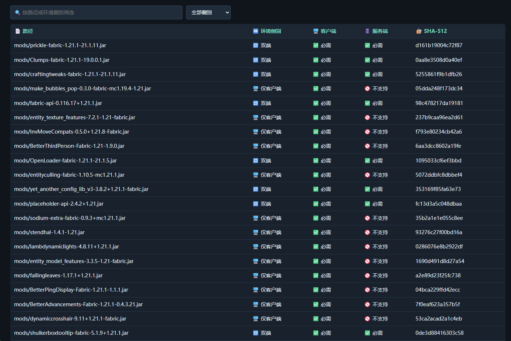
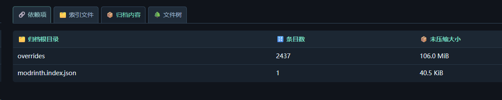
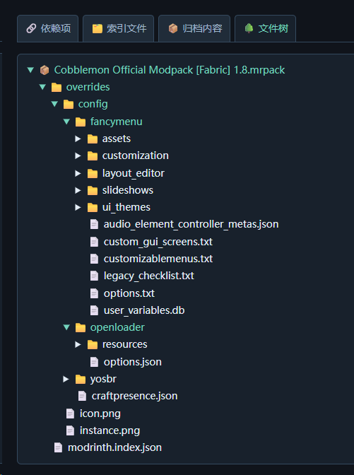

# 📦 MRPACK 检查器 / 📦 MRPACK Inspector

🧭 使用 Python 标准库构建的单文件 WebUI，用于读取和浏览 Modrinth `.mrpack` 整合包。 / 🧭 A single-file WebUI built with the Python standard library for reading and browsing Modrinth `.mrpack` modpacks.

[](https://support.modrinth.com/en/articles/8802250-modpacks-on-modrinth)

## ✨ 功能 / ✨ Features

- 📂 支持启动参数预加载本地 `.mrpack`，也支持浏览器选择或拖放上传。 / 📂 Preload a local `.mrpack` through a startup argument, or select and drop one in the browser.
- 🔗 展示 Minecraft、Fabric Loader 等整合包依赖项。 / 🔗 Display modpack dependencies such as Minecraft and Fabric Loader.
- 🗂️ 展示 Modrinth 索引文件，并可按路径或客户端 / 服务端侧别筛选。 / 🗂️ Display Modrinth indexed files, with filtering by path or client / server side.
- 📦 展示 ZIP 归档根目录统计与完整可折叠文件树。 / 📦 Display ZIP archive root statistics and a complete collapsible file tree.
- 🔎 在文件树中搜索文件名、文件夹名或受限 UTF-8 文本内容，并用上/下按钮、方向键或 W/S 切换匹配项。 / 🔎 Search the file tree by file name, folder name, or bounded UTF-8 text content, then navigate matches with previous/next buttons, arrow keys, or W/S.
- 🌐 提供简体中文、繁体中文、英文和跟随系统语言模式。 / 🌐 Provide Simplified Chinese, Traditional Chinese, English, and a follow-system language mode.
- 🖥️ 提供跟随系统、深色、浅色三种主题模式。 / 🖥️ Provide follow-system, dark, and light theme modes.

## 🚀 启动 / 🚀 Start

💡 环境要求：Python 3.11 或更高版本；不需要安装第三方依赖。 / 💡 Requirement: Python 3.11 or newer; no third-party dependency installation is required.

```powershell
python .\read_mrpack_page.py
```

🔗 默认访问地址：`http://127.0.0.1:60907` / 🔗 Default address: `http://127.0.0.1:60907`

```powershell
python .\read_mrpack_page.py --mrpack 'G:\GGames\Minecraft\aaaSERVERSaaa\aaaMRPACKSaaa\Cobblemon Official Modpack [Fabric] 1.8.mrpack'
```

📡 局域网访问时使用下列命令；上传接口没有认证，仅应暴露给可信网络。 / 📡 Use the command below for LAN access; the upload endpoint has no authentication and must only be exposed to trusted networks.

```powershell
python .\read_mrpack_page.py --host 0.0.0.0 --port 60907 --mrpack 'G:\GGames\Minecraft\aaaSERVERSaaa\aaaMRPACKSaaa\Cobblemon Official Modpack [Fabric] 1.8.mrpack'
```

## ⚙️ 参数 / ⚙️ Arguments

| 🏷️ 参数 / 🏷️ Argument | 📝 说明 / 📝 Description |
| --- | --- |
| `--mrpack PATH` | 📂 启动时读取的本地 `.mrpack` 文件。 / 📂 Local `.mrpack` file to read at startup. |
| `--host HOST` | 🌐 监听地址，默认 `127.0.0.1`。 / 🌐 Bind address; defaults to `127.0.0.1`. |
| `--port PORT` | 🔌 监听端口，默认 `60907`。 / 🔌 Bind port; defaults to `60907`. |
| `--max-upload-mib SIZE` | 📏 浏览器上传上限，默认 `1024` MiB。 / 📏 Browser upload limit; defaults to `1024` MiB. |

## 🖼️ 预览 / 🖼️ Preview

### 🔗 依赖项 / 🔗 Dependencies



### 🗂️ 索引文件 / 🗂️ Indexed Files



### 📦 归档内容 / 📦 Archive



### 📊 文件数 / 📊 File Count



## 🔒 安全边界 / 🔒 Security Boundaries

- ✅ 只接受 `.mrpack` 扩展名，且要求归档内存在 `modrinth.index.json`。 / ✅ Only accepts the `.mrpack` extension and requires `modrinth.index.json` inside the archive.
- ✅ 限制索引 JSON 最大为 16 MiB，归档条目最大为 100,000 个。 / ✅ Limits index JSON to 16 MiB and archive entries to 100,000.
- ✅ 上传文件仅在当前查看期间临时保留，用于文件树文本搜索；上传新包或服务器停止时删除。 / ✅ Retains uploaded files only for the active inspection so file-tree text search can work; deletes them when replaced or the server stops.
- ✅ 文本搜索仅扫描 UTF-8 文本，单文件最多 2 MiB、每个整合包累计最多 32 MiB。 / ✅ Text search scans only UTF-8 text, up to 2 MiB per file and 32 MiB per modpack.
- ⚠️ 局域网模式没有访问认证，请勿直接暴露到公网。 / ⚠️ LAN mode has no access authentication. Do not expose it directly to the public internet.
